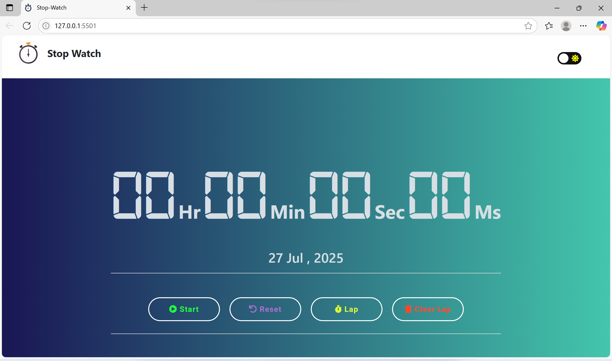
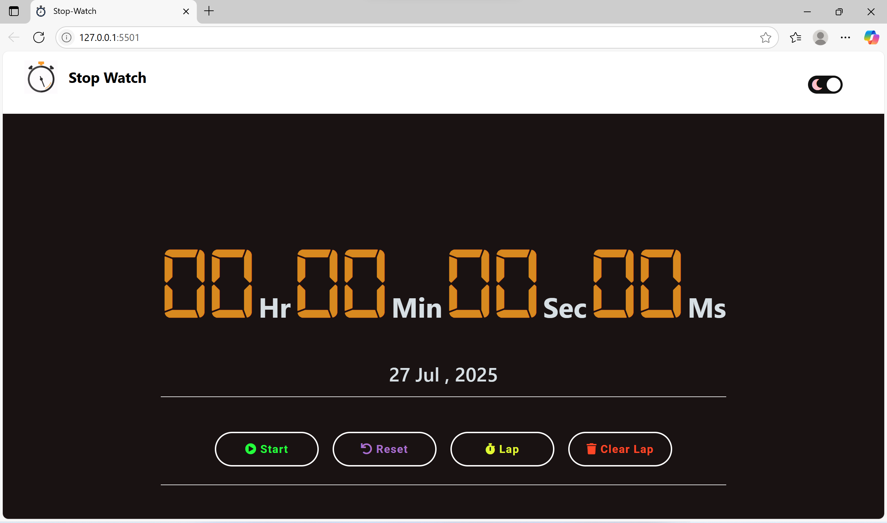

# ⏱ Stopwatch Web App

A modern, responsive **Stopwatch Web Application** with lap timing, dark/light mode, sound alerts, and keyboard shortcuts. Built using **HTML, CSS, and JavaScript**.

---

## 🚀 Features:

- **Start / Pause / Reset** Stopwatch
- **Lap Functionality** (records lap times with differences)
- **Dark & Light Theme Toggle**
- **Responsive Design** for mobile and desktop
- **Sound Alerts** on actions

- **Keyboard Shortcuts**

  - **Space** → Start/Pause
  - **Backspace** → Reset
  - **Enter** → Record Lap
  - **Numpad 0** → Clear Laps

---

## 📂 Project Structure

├── index.html # Main HTML file
├── style.css # Styling (light & dark modes)
├── script.js # Stopwatch logic
├── jquery.js # Theme & local storage
├── img/ # Image assets (logo, favicon)
├── audio/ # Sound effects
└── README.md # Project documentation

---

## 🛠 Tech Stack:

- **HTML5**
- **CSS3**
- **JavaScript (ES6)**
- **jQuery**
- **Bootstrap**

---

## 📸 Screenshots:

### Stopwatch Interface:





---

## ⚡ How to Run:

1. Clone the repository:
   ```bash
   git clone https://github.com/madhumithamohan2801/stopwatch-web.git

📜 License:

This project is licensed under the MIT License – see the LICENSE file for details.

👩‍💻 Author:

Madhumitha Mohankumar 🎓 B.E. CSE | Web Developer Intern | Java Full Stack Learner 🔗 GitHub Repository 📫 Connect on LinkedIn 🌟 Star the repo if you like it! take it as reference
